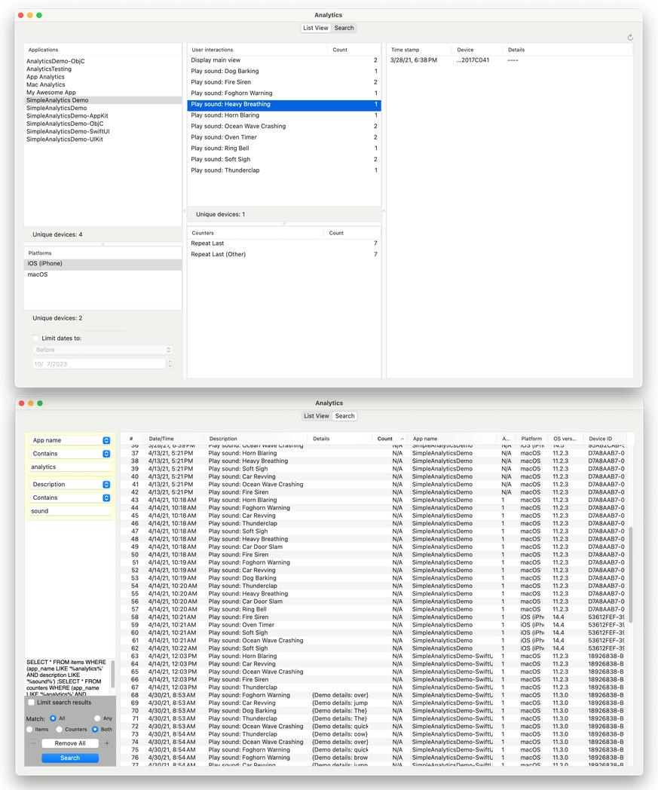

# SimpleAnalytics

[](https://swiftpackageindex.com/dennisbirch/simple-analytics)
[](https://swiftpackageindex.com/dennisbirch/simple-analytics)

### A lightweight analytics reporting package for iOS and macOS projects.
You may want to gain the insights that analytics reporting can provide to your iOS or Mac app, but don't want to take on the unknowns, or the potentially intrusive oversharing that some third party analytics packages perform. _SimpleAnalytics_ is an alternative that puts all the control of what goes out, and who it goes to, into your hands.

SimpleAnalytics allows you to capture user actions in your apps and submit them to a server you control or have access to. The companion project, [__SimpleAnalytics Reader__](https://www.github.com/dennisbirch/simple-analytics-reader) (see the _Viewing collected data_ section below), lets you access the data you collect in a Macintosh desktop application.

See the SimpleAnalyticsDemo project for a rudimentary example of using it in an Xcode project.

## Installation
SimpleAnalytics is distributed as a Swift package, which you can load into Xcode projects using the available tools built into Xcode 11.0 and higher.

In the Swift Packages section of the Project configuration panel, include a dependency for SimpleAnalytics with the URL:

`https://github.com/dennisbirch/simple-analytics`

Be sure to add SimpleAnalytics to your target's Frameworks list if it isn't added automatically.


## Usage
Once you've added SimpleAnalytics to your Xcode project, you can begin adding code to begin capturing app usage data.

The first step is to configure the app to point to a web service that you've set up to handle SimpleAnalytics requests. 

* See any of the example apps included in the package for implementations of app configuration. 
* See the documentation below for more details on what is required for configuring the app, and what the web app expects to receive and should return. 
* See the _analytics.php_ file for an example of a back-end web app.

You can call into the SimpleAnalytics package from anywhere in your application's code by importing the SimpleAnalytics module, and then using one of the two static methods available to record observations. As described in more detail below, there are methods for 1) recording an action with optional additional details, and 2) incrementing a counter when an action occurs. 

In code that could look like:

```
AppAnalytics.addItem("Logged out")
AppAnalytics.addItem("Logged in", params: ["method" : loginMethod])
AppAnalytics.addItem("Changed 'Timeout' settings", params: ["minutes" : String(newTimeout),
                                                            "apply to" : String(describing: applyToOptions)])

AppAnalytics.countItem("Foregrounded app")
AppAnalytics.countItem("Set new password")

```
See any of the example applications for other usage examples, and an approach to centralizing calls to the SimpleAnalytics module in one controller type.

## Viewing collected data


A companion open-source project, __SimpleAnalytics Reader__ is available to allow you to view the data your apps are collecting about their usage. You can find it at <https://www.github.com/dennisbirch/simple-analytics-reader>. It includes source for a macOS app, and a backend web app you can run as is, or use for inspiration to write your own back-end. The interface offers different ways of querying for and viewing data to fit your needs.

## Documentation
### Configuration
The SimpleAnalytics package requires one configuration step for full implementation, and offers a couple of other configuration options.

#### Endpoint (and shared application on iOS)
In order to submit your app's analytics data from users' devices to a web service where you can access it, you'll need to set the endpoint for the web service. The web service can be any web application that can handle a JSON payload. 

New in version 2.0 and higher: On iOS, you also need to provide a reference to the shared application instance. SimpleAnalytics uses this to request and dispose of a background task when submitting data to your web service.

To set the endpoint on __macOS__, call the `AppAnalytics.setEndpoint(_:submissionCompletionCallback:)` method.

__Parameters:__

_urlString_: String for your web service URL.

_submissionCompletionCallback_: An optional completion with no argument and no return value to signal to your macOS app that submission is complete. This can be useful to implement a strategy for terminating the app _after_ analytics submission has completed.

To set the endpoint and shared app on __iOS__, call the `AppAnalytics.setEndpoint(_:, sharedApp:)` method.

__Parameters:__

_urlString_: String for your web service URL. 

_sharedApp_: Pass the __UIApplication.shared__ property to this argument.

This call should be made as early as possible in your app's lifecycle.

#### Platform name
To help differentiate data entries, SimpleAnalytics includes a field for the platform for every entry. The framework automatically assigns the values *iOS* and *macOS* for those platforms along with the device type for iOS. But if your app is running in a hybrid environment (e.g. iOS app running on Mac), you can override that assignment with the `AppAnalytics.setPlatform(_:)` method.

__Parameters:__

_platformName_: String with a platform name. 

#### <span id=submission>Maximum count</span>

SimpleAnalytics automatically attempts to submit its contents when the total count of its data items reaches the maximum count value. The default maximum value is 100, but you can change that to fit the needs of your application. To change the maximum count value, call the `AppAnalytics.setMaxItemCount(_:)` method.

__Parameters:__

_count_: Int defining the base maximum number of items to accumulate before attempting to submit them to your server.

#### Submit failure increment

When a submit attempt fails, SimpleAnalytics restores the items it was attempting to submit for a subsequent resubmit attempt. It also increments the maximum count value to add a delay before subsequent new events trigger another submission attempt. The default value for this failure increment is 20. You can change that by calling the `AppAnalytics.setSubmitFailureIncrement(_:)` method.

__Parameters:__

_increment_: Int defining the amount to be added to the maximum item count before again attempting to submit entries.

#### Overriding the 'submit at dismissal' behavior
SimpleAnalytics' automatically attempts to submit its data when going into the background. You can override that behavior by calling the `AppAnalytics.overrideSubmitAtDismiss(: )` method.

__Parameters:__

_shouldSubmit_: Bool. Pass in _false_ to turn off automatic submission, or _true_ to turn the behavior back on.

### Recording data

SimpleAnalytics offers two ways of recording analytics data.

_Analytics item_: This option lets you define a name for the item and optionally include a [String:String] dictionary of additional parameters. _It is your responsibility to ensure that you do not include private user information._

_Counter_: This option allows you to name an action or behavior you want to record, and increment a counter each time it's repeated.

#### Analytics item
To add an analytics item, call `AppAnalytics.addItem(_: parameters:)`.

__Parameters:__

_description_: String describing the action or user interaction

_params_: An optional [String:String] dictionary of additional details to record (e.g. certain app state observations) for more refined analysis

#### Counter
To add or increment a counter, call `AppAnalytics.countItem(_:)`. Note that adding a new counter adds an item to the total count. Incrementing an existing counter does not add to the item count. Because of this and the fact that counters do not include additional details and do not receive a timestamp, they are more lightweight than analytics items.

__Parameters:__

_description_: String describing the item to be counted. An item is added and set to a value of 1, or incremented by 1.

### Submitting data
SimpleAnalytics keeps all the analytics entries you add in two arrays in the `AppAnalytics` shared instance until it attempts to submit the data to your server. By default, SimpleAnalytics attempts submissions after a total of 100 items have accumulated, and when the application hosting it is sent to the background.

If a submission attempt fails, the items that were removed from the AppAnalytics arrays are restored for the next attempt. 

As discussed above [in the Configuration section](#submission), you can configure some values to influence when AppAnalytics submits data.

#### Forcing a submission attempt
You can trigger a submission attempt at any time by calling the `AppAnalytics.submitNow()` method.

#### Getting a count of data items
It may be helpful in determining whether to force a submission attempt to know the total count of the AppAnalytics data arrays. To do so, access the `AppAnalytics.itemCount` public property.

##### JSON Payload
AppAnalytics submits its data in a JSON payload with the following format:

|Label         | Contents                                                                                                      |
|------------- | --------------------------------                                                                              |
|__items__     | An array of analytics item entries, each of which includes:                                                   |
|              | _description_: The description of the item as defined by the call to AppAnalytics.addItem(_:, parameters)     |
|              | _parameters_: An *optional* String:String dictionary of additional details                                    |
|              | _device_id_: A string with a unique identifier for your app on each device running it                         |
|              | _app_name_: A string with the name of the application where the analytics item was generated                  |
|              | _app_version_: A string with the application's version number, as defined in its info.plist file                  |
|              | _platform_: A string with the name of the platform in which the app was running (iOS or macOS), and the device type (iPhone or iPad) for iOS   |
|              | _system_version_: A string with the operating system version the user is running                              |
|              | _timestamp_: A string with the date and time that the item was generated, in ISO8661 format for the user's timezone |
|__counters__  | An array of 'counters', each of which includes:                                                               |
|              | _name_: The name of the action being counted, as defined by the call to AppAnalytics.countItem(_:)            |
|              | _count_: The number of times the event was counted during the current analytics collection session            |
|              | _device_id_: A string with a unique identifier for your app on each device running it                         |
|              | _app_name_: A string with the name of the application where the analytics item was generated                  |
|              | _app_version_: A string with the application's version number, as defined in its info.plist file                  |
|              | _platform_: A string with the name of the platform in which the app was running (iOS or macOS), and the device type (iPhone or iPad) for iOS   |
|              | _system_version_: A string with the operating system version the user is running                              |
|              | _timestamp_: A string with the date and time that the first count was recorded, in ISO8661 format for the user's timezone |

##### JSON Response
Your web app should respond to handling the payload with a JSON payload in the following format:

Label         | Contents                     
------------- | --------------------------------
__message__   | A string with any message. In the default implementation, the string is logged in debug builds.

__NOTE:__ Failure to send a properly formatted response will cause SimpleAnalytics to resend the same items again.

See the _Analytics.php_ file included in the package for an example of how you might handle the incoming JSON payload and send a response on a web server.

### Persisting analytics data

SimpleAnalytics provides methods for persisting collected data to disk and restoring it from that persistence store. It does not call either of these methods by default to avoid that being responsible for duplicate entries. If you would like to manage when data is saved and restored, these methods are available to you.

To persist analytics data, call the `AppAnalytics.persistContents()` method. 

To restore saved contents (e.g. at app launch), call the `AppAnalytics.restorePersistenceContents()` method.

## Contributing
Contributions are welcome. To suggest an improvement, please submit a pull request.

